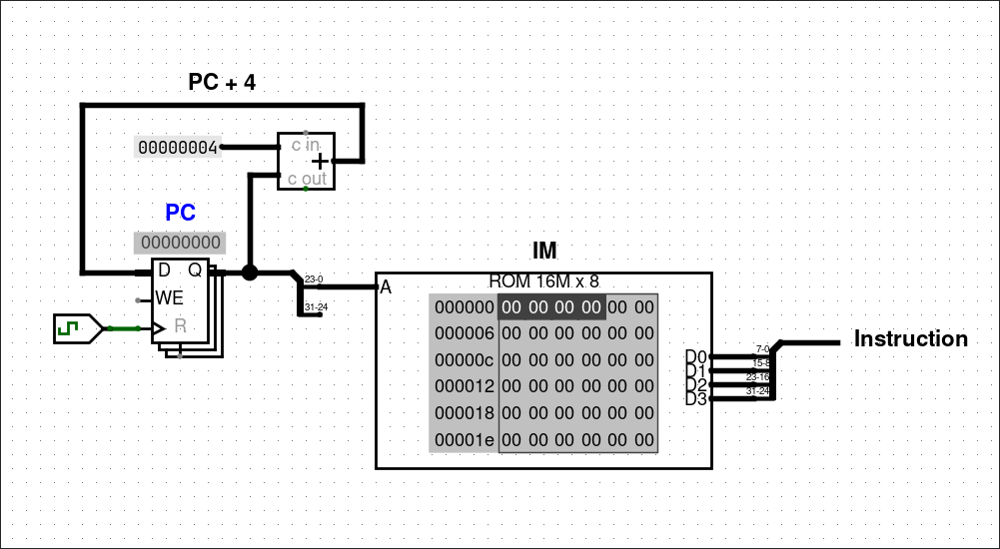
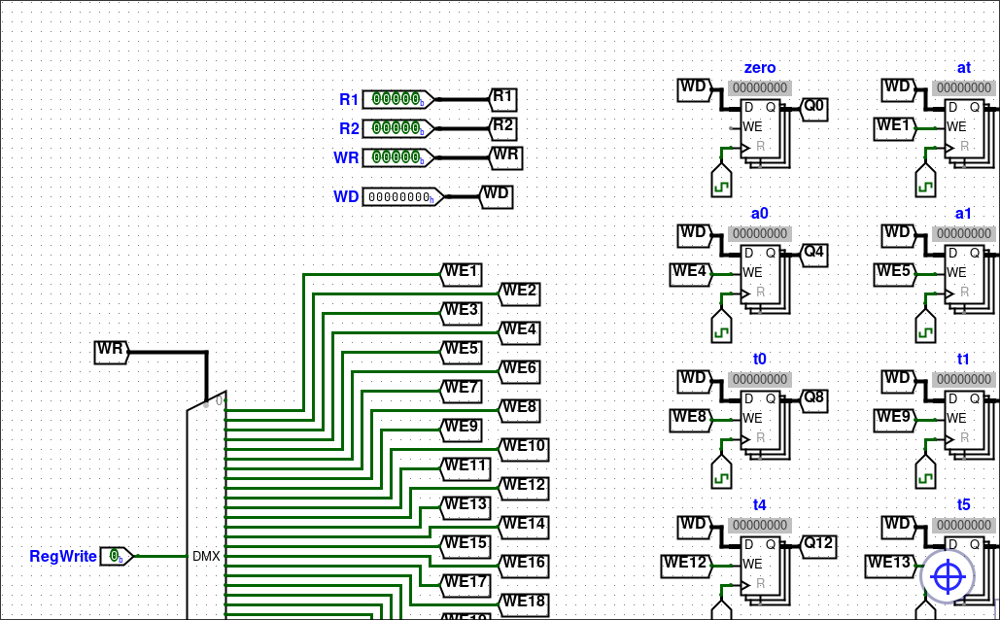
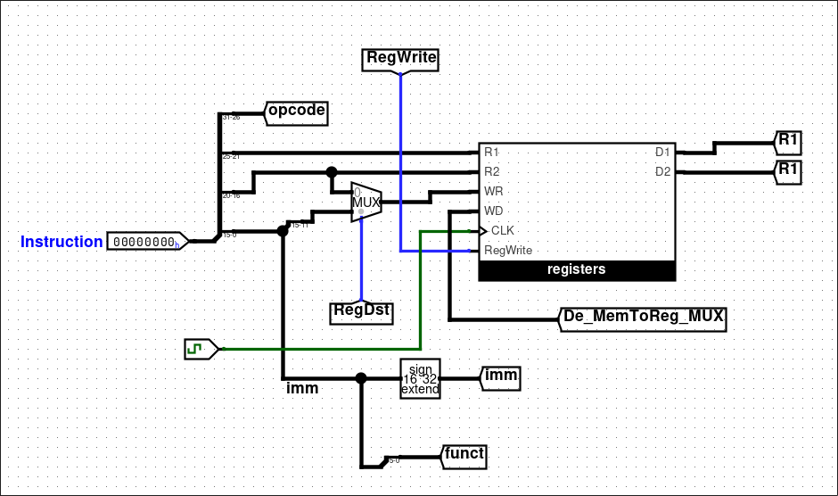

# Circuitos

## Primer circuito

Hoy 10/09 subo un [circuito](./00-4instr) de un *datapath* de 4 instrucciones. La idea era entender el ciclo de instrucción y como una instrucción pasa por las etapas de *fetch*, *decode* y *execute*. Está lejos de ser una computadora completa.

La arquitectura usa un *opcode* de 2 bits y un *immediate* o *address* de 6 bits que es extendido a ocho bits. Los únicos elementos de estado son el PC (*Program Counter*) y el registro A (acumulador). En la siguiente tabla se muestra el significado y codificación de cada instrucción.

|Instrucción|Opcode|Pseudocódigo|
|---|---|---|
|`add`|00|`A = A + imm`|
|`mul`|01|`A = A * imm`|
|`jze`|10|`if (A == 0) PC = addr`|
|`lda`|11|`A = imm`|

## Segundo circuito

Hoy 14/09 subo un [circuito](./01-fetch) con la fase de *fetch* del *datapath* de ciclo único de MIPS.

La única salvedad del circuito es que Logisim no permite ROMs con direcciones de más de 24 bits, en la CPU real sería de 32 bits el puerto de direcciones de la ROM (la memoria de instrucciones).

## Tercer circuito

Hoy 14/09 cuarto primera estuvo armando el [archivo de registros](./02-regfile), es un proceso tedioso pero sencillo. Para elegir el registro a escribir usamos un decodificador (o demultiplexor para pasar la señal de RegWrite). Para elegir los registros de salida se usan multiplexores. 

Lo tedioso está en que estos decodificadores y multiplexores tienen 32 salidas o entradas y son muchos cables. En Logisim conviene resolverlo usando tuneles porque sino los cables empiezan a cruzarse entre sí y la chance de cometer un error es alta.

## Cuarto circuito

Hoy 16/09 agregamos la fase de *instruction decode*. En este [circuito](./03-decode) llega la instrucción de 32 bits y se leen los registros del archivo de registros, se extiende a 32 bits el inmediato y se pasan los códigos `op` y `funct` a control para decodificar qué instrucción ejecutar.

## Aclaraciones

Los archivos `.circ` son para abrir con Logisim Evolution, lo pueden descargar [acá](https://github.com/logisim-evolution/logisim-evolution/).

El QtMIPS lo pueden descargar de [acá](https://github.com/cvut/QtMips) y lo pueden probar online [acá](https://comparch.edu.cvut.cz/qtmips/app/).
