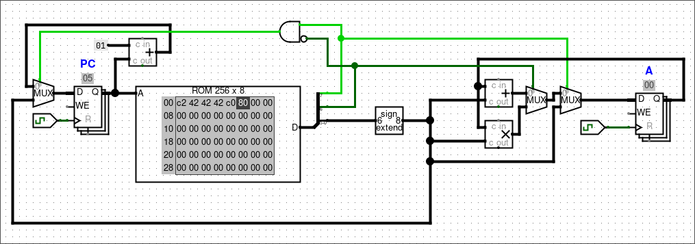

# Circuitos

1. Hoy 10/09 subo un [./00-4instr](circuito) de un *datapath* de 4 instrucciones. La idea era entender el ciclo de instrucción y como una instrucción pasa por las etapas de *fetch*, *decode* y *execute*. Está lejos de ser una computadora completa.

La arquitectura usa un *opcode* de 2 bits y un *immediate* o *address* de 6 bits que es extendido a ocho bits. Los únicos elementos de estado son el PC (*Program Counter*) y el registro A (acumulador). En la siguiente tabla se muestra el significado y codificación de cada instrucción.

|Instrucción|Opcode|Pseudocódigo|
|---|---|---|
|add|00|A = A + imm|
|mul|01|A = A * imm|
|jze|10|if (A == 0) PC = addr|
|lda|11|A = imm|

## Aclaraciones

Los archivos `.circ` son para abrir con Logisim Evolution, lo pueden descargar [github.com/logisim-evolution/logisim-evolution/](acá).

El QtMIPS lo pueden descargar de [https://github.com/cvut/QtMips](acá) y lo pueden probar online [https://comparch.edu.cvut.cz/qtmips/app/](acá).
