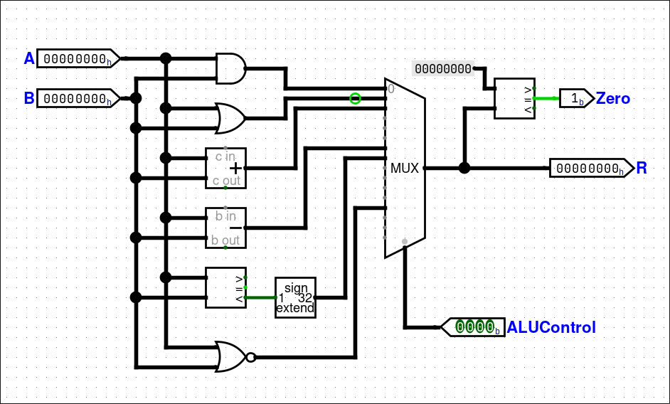
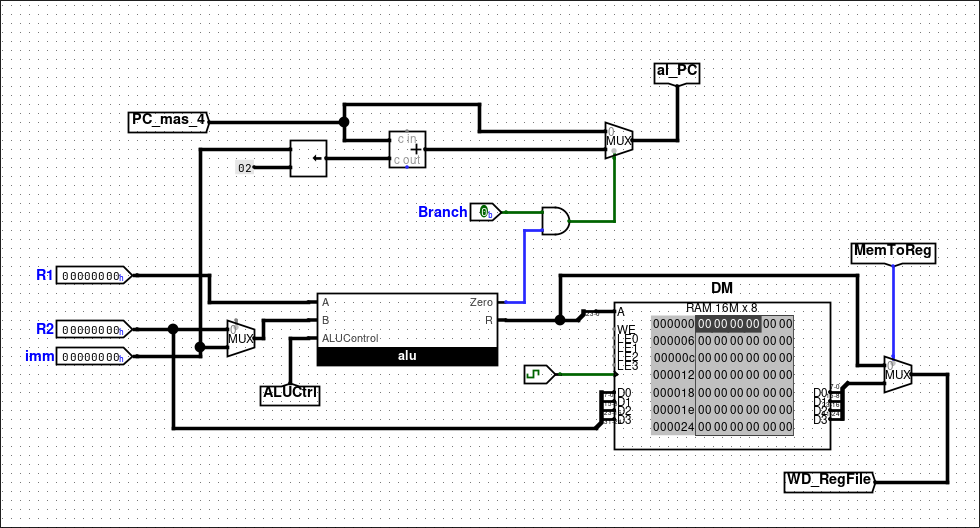
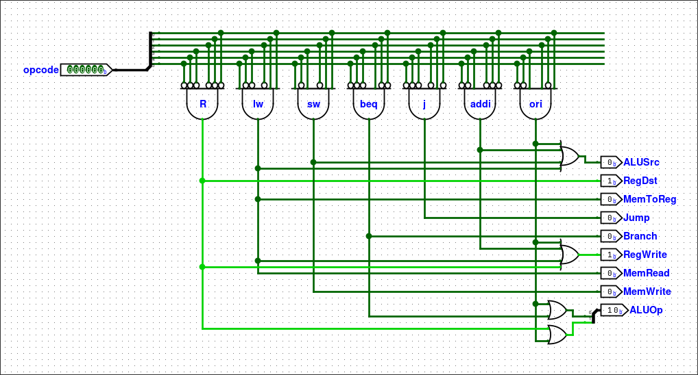
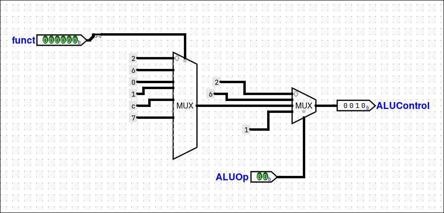

# Circuitos

## Primer circuito

Hoy 10/09 subo un [circuito](./00-4instr) de un *datapath* de 4 instrucciones. La idea era entender el ciclo de instrucción y como una instrucción pasa por las etapas de *fetch*, *decode* y *execute*. Está lejos de ser una computadora completa.

La arquitectura usa un *opcode* de 2 bits y un *immediate* o *address* de 6 bits que es extendido a ocho bits. Los únicos elementos de estado son el PC (*Program Counter*) y el registro A (acumulador). En la siguiente tabla se muestra el significado y codificación de cada instrucción.

|Instrucción|Opcode|Pseudocódigo|
|---|---|---|
|`add`|00|`A = A + imm`|
|`mul`|01|`A = A * imm`|
|`jze`|10|`if (A == 0) PC = addr`|
|`lda`|11|`A = imm`|

## Segundo circuito

Hoy 14/09 subo un [circuito](./01-fetch) con la fase de *fetch* del *datapath* de ciclo único de MIPS.

La única salvedad del circuito es que Logisim no permite ROMs con direcciones de más de 24 bits, en la CPU real sería de 32 bits el puerto de direcciones de la ROM (la memoria de instrucciones).

## Tercer circuito

Hoy 14/09 cuarto primera estuvo armando el [archivo de registros](./02-regfile), es un proceso tedioso pero sencillo. Para elegir el registro a escribir usamos un decodificador (o demultiplexor para pasar la señal de RegWrite). Para elegir los registros de salida se usan multiplexores. 

Lo tedioso está en que estos decodificadores y multiplexores tienen 32 salidas o entradas y son muchos cables. En Logisim conviene resolverlo usando tuneles porque sino los cables empiezan a cruzarse entre sí y la chance de cometer un error es alta.

## Cuarto circuito

Hoy 16/09 agregamos la fase de *instruction decode*. En este [circuito](./03-decode) llega la instrucción de 32 bits y se leen los registros del archivo de registros, se extiende a 32 bits el inmediato y se pasan los códigos `op` y `funct` a control para decodificar qué instrucción ejecutar.

## Quinto circuito

También el 16/09 los alumnos de cuarto segunda estuvieron armando la ALU de MIPS en Logisim. [Esta ALU](./04-alu) implementa un subconjunto de las operaciones de la CPU real, usa una señal de control de 4 bits llamada *ALU Control* como se muestra en la siguiente tabla.

|ALU Control|Operación|
|---|---|
|0000|AND|
|0001|OR|
|0010|suma|
|0110|resta|
|0111|SLT|
|1100|NOR|

La idea principal en una ALU cualquiera es que el circuito realiza todas las operaciones sobre A y B en paralelo pero en resultado solo vemos la operación que elige el multiplexor.

## Sexto circuito

Hoy 17/09 con cuarto primera subimos la [fase](./05-execute) de *execute*. Acá vemos la lógica para el `beq`, la memoria de datos para `lw` y `sw` y la ALU para las cuentas.

## Séptimo circuito

Hoy 23/09 con cuarto segunda subimos la [unidad de control](./06-control) principal. Este circuito es un decodificador que recibe los 6 bits del *opcode* y produce como salida las señales de control necesarias para el camino de datos que estamos implementando. Las instrucciones conocidas para este decodificador son: `addi`, `ori`, `beq`, `j`, `lw`, `sw` y las de tipo R.

|Opcode|Instrucción|
|---|---|
|0|Tipo R|
|2|`j`|
|4|`beq`|
|8|`addi`|
|13|`ori`|
|35|`lw`|
|43|`sw`|

La señal de control *ALUOp* es necesaria porque no todas las instrucciones de tipo I realizan una suma en la ALU, `beq` hace una resta y `ori` un OR.

## Octavo circuito

La [unidad de control de la ALU](./07-alu-ctrl). Hoy 23/09 con cuarto segunda vimos como se generan las señales de control para la ALU a partir de *ALU Op* y del campo *funct* de las instrucciones tipo R. Para implementar el circuito se usaron las constantes que necesitamos como salidas conectadas a un par de multiplexores que eligen primero a partir de *funct* y luego según el valor de *ALU Op*.

El comportamiento del circuito se puede resumir con la siguiente tabla.

|Instrucción|funct|ALU Op|ALU control|
|---|---|---|---|
|`lw`|xxxxxx|00|0010|
|`sw`|xxxxxx|00|0010|
|`beq`|xxxxxx|01|0110|
|`add`|100000|10|0010|
|`sub`|100010|10|0110|
|`and`|100100|10|0000|
|`or`|100101|10|0001|
|`slt`|101010|10|0111|
|`nor`|100111|10|1100|
|`addi`|xxxxxx|00|0010|
|`ori`|xxxxxx|11|0001|

## Aclaraciones

Los archivos `.circ` son para abrir con Logisim Evolution, lo pueden descargar [acá](https://github.com/logisim-evolution/logisim-evolution/).

El QtMIPS lo pueden descargar de [acá](https://github.com/cvut/QtMips) y lo pueden probar online [acá](https://comparch.edu.cvut.cz/qtmips/app/).
